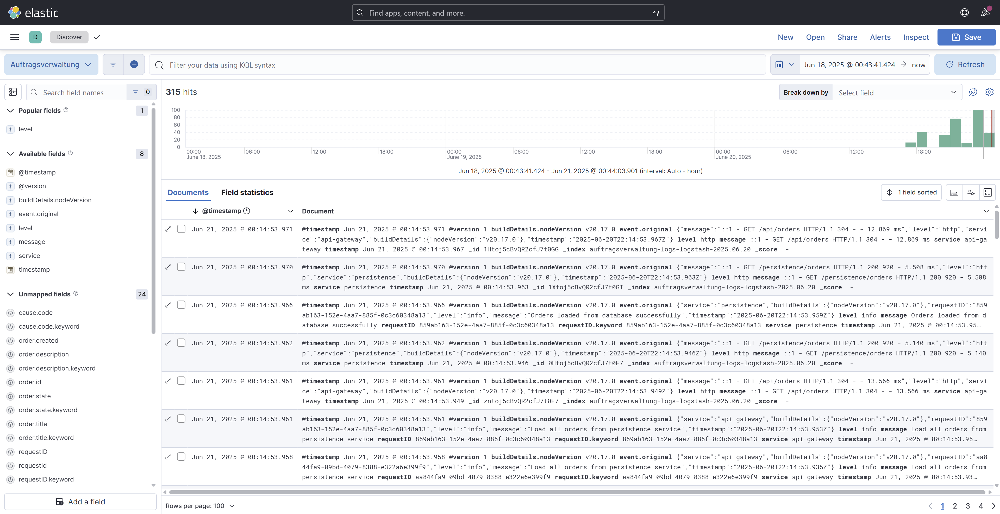
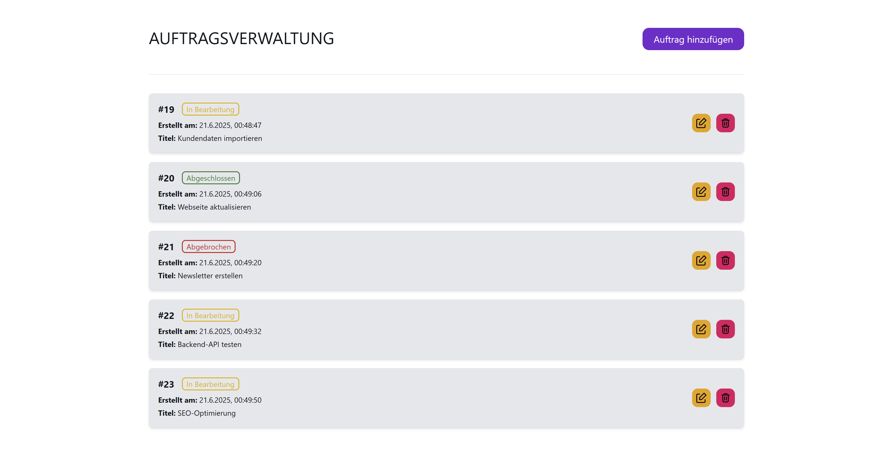
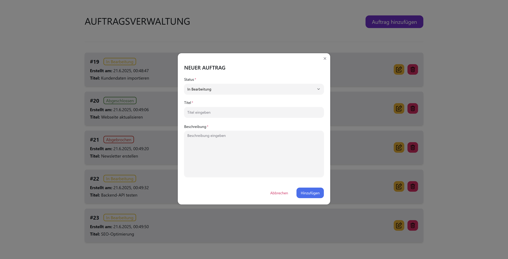

<h1 align="center">
  Demo Microservice Logger 🗒️
  <p style="font-style: italic ">monitored by ELK Stack</p>
</h1>

A minimal microservice-based logging demo powered by react, express and monitored by the ELK Stack (Elasticsearch, Logstash, Kibana).

This project includes:
- A simple React UI for managing orders (CRUD functionality)
- Two Node.js / Express microservices:
    - **API Gateway:** Handles external requests and forwards them
    - **Persistence Service:** Manages database operations via Prisma and PostgreSQL
- Both services use Winston and Morgan for logging and send logs to Logstash
- Logs are visualized in Kibana, with the full ELK stack running in Docker


# Screenshot

<div align="center" style="display: flex; justify-content: center; flex-wrap: wrap; gap: 2em">
  
  
  
</div >

# Structure

### Docker ELK-Stack
- Elasticsearch
- Logstash
- Kibana
  
### Frontend
- react-app auftragsverwaltung-ui
  
### Backend
- api-gateway service
- persistence service 

# Requirements

- NodeJS
- Docker & Docker Compose
- PostgresSQL Database

# Setup

```bash
# 1. Clone repository
$ git clone https://github.com/kecioch/demo-microservice-logger

# 2. Navigate into repository
$ cd demo-microservice-logger
```

## Docker Container

```bash
# 1. Navigate into folder (from main folder)
$ cd elk-stack

# 2. Rename .env.sample to .env (and configure it if needed)

# (3. Configure container & logstash)
# edit docker-compose.yml
# edit logstash/logstash.conf

# 4. Build & run docker container
$ docker-compose up --build

# 5. Open kibana dashboard in your webbrowser
# http://localhost:5601/

# (6. Remove docker container)
$ docker-compose down
```

## Frontend

```bash
# 1. Navigate into folder (from main folder)
$ cd frontend/auftragsverwaltung-ui

# 2. Install dependencies
$ npm i

# 3. Rename .env.sample to .env (and configure it if needed)

# 4. Start application
$ npm run start
```

## Backend

```bash
# API-GATEWAY
# 1.1. Navigate into folder (from main folder)
$ cd backend/api

# 1.2. Install dependencies
$ npm i

# 1.3. Rename .env.sample to .env (and configure it if needed)

# 1.4. Start application
$ npm run dev

# PERSISTENCE
# 2.1. Navigate into folder (from main folder)
$ cd backend/persistence

# 2.2. Install dependencies
$ npm i

# 2.3. Rename .env.sample to .env (and configure it if needed)

# 2.4. Map data model to the database schema
$ npx prisma migrate dev --name init

# 2.5. Generate prisma client based on schema
$ npx prisma generate

# 2.6. Start application
$ npm run dev

# (2.7. Start prisma studio to view database)
$ npx prisma studio
```

# Technologies

- [React](https://reactjs.org/)
- [Tailwind](https://tailwindcss.com/)
- [ExpressJS](https://expressjs.com/)
- [Docker](https://www.docker.com/)
- [PostgresSQL](https://www.postgresql.org/)
- [Prisma](https://www.prisma.io/)
- [Elastic](https://www.elastic.co/)
